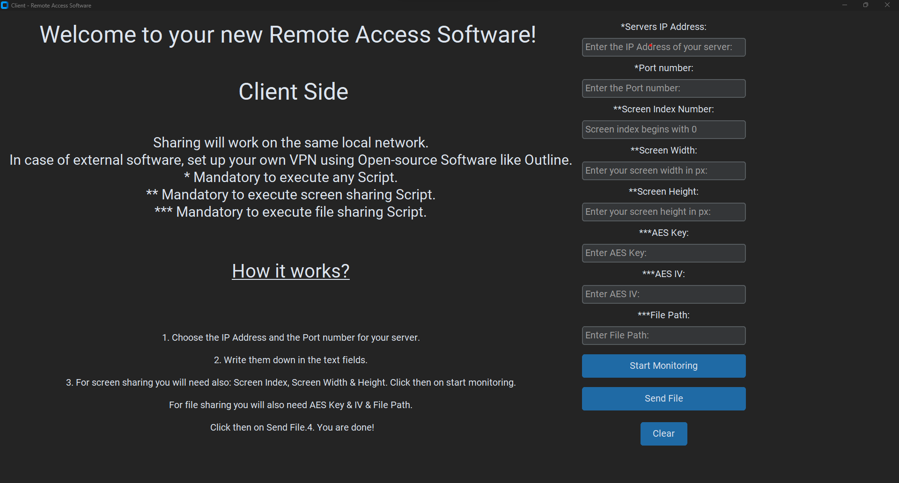
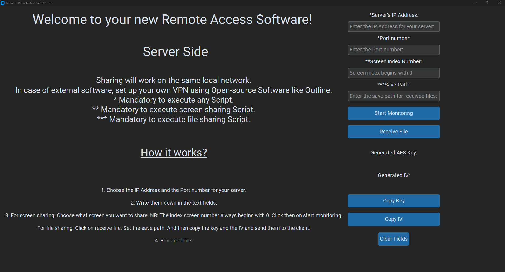
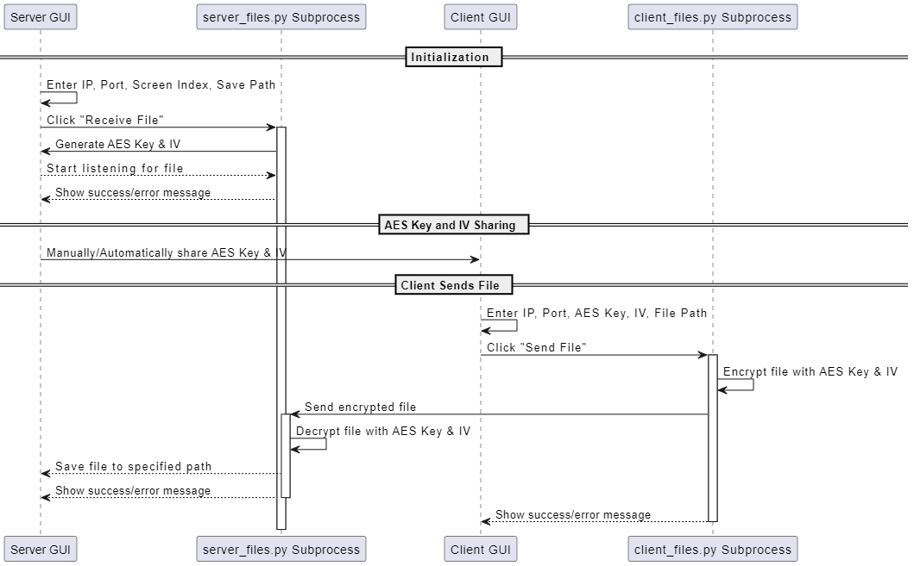

# Peer-to-Peer Remote Access Software

## Introduction

This project introduces a cutting-edge, Python-based solution for remote desktop access, focusing on secure and efficient operations. Leveraging modern encryption and real-time data handling, it simplifies remote interactions for users needing access to files, screen content, and system control across distances.

## Key Capabilities

- **Screen Sharing:** Effortlessly share your screen with trusted users in real-time.
- **AES-128 Encrypted File Transfer:** Transfer files securely, ensuring confidentiality and integrity.
- **Remote Input Control:** (Under development) Gain control over a remote system's mouse and keyboard as if you're physically present.

## Technical Overview

The software architecture combines Python's flexibility with the robustness of TCP/IP networking, encryption, and GUI development, featuring multi-threading to manage concurrent processes efficiently.

## Security Measures

Employs AES-128 for encryption, guaranteeing secure data transmission and prioritizing user privacy and data protection.

## Setup Guide

### Requirements

- Min. Python 3.7
- Essential libraries: `customtkinter`, `tkinter`, `subprocess`, `os`, `sys`, `socket`,`CV2`,`Struct`, `PIL`,`numpy`,`threading`, `mss`,`screeninfo`.

### Installation Steps

1. Clone the project repository.
2. Install necessary Python libraries using: `pip install -r requirements.txt`.

### Usage Instructions

#### Screen Sharing

**Server Setup for Screen Sharing:**

1. Launch the Server GUI and input the IP address, port, and screen number.
2. Click "Start Monitoring" to run `server.py` with the provided parameters.
3. A success message will appear in the GUI with terminal status indicating readiness.

**Client Setup for Screen Sharing:**

1. Launch the Client GUI.
2. Fill in the server's IP address, port, and screen number, along with screen dimensions.
3. Click to start monitoring. A success message will confirm the connection.

#### File Sharing

**Server Setup for File Sharing:**

1. Open the Server GUI and enter IP, port, screen number, and save path for files.
2. Click "Receive File" for a success message and subprocess initiation using AES key and IV.

**Client Setup for File Sharing:**

1. Open the Client GUI and input the AES key and IV, along with server's IP and port.
2. Select the file for transfer and click "Send File."
3. A confirmation message will indicate the transfer status.

## Future Enhancements

- Implementing audio support for comprehensive remote access.
- Complete integration of remote mouse and keyboard functionalities.
- Optimizing data transfer for improved performance.
- Introducing advanced security protocols for enhanced protection.

## Contributing

I welcome contributions! For significant modifications, please start a discussion via issues.

## License

Distributed under the MIT License. See `LICENSE` for more information.

## Contact Information

For queries or questions, reach out at driss@kabbaj.me.
